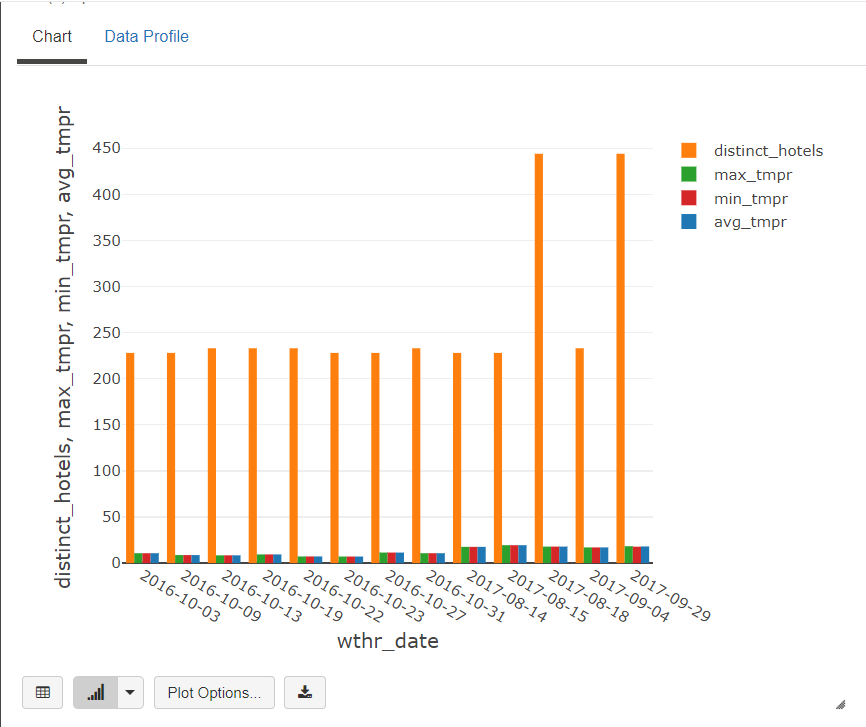

# Setup
First we will need the Azure resources

### Terraform

Login to Azure
```bash
az login
```

Deploy ADLS Gen 2 storage and Azure Databricks with the following commands:
```bash
terraform init
terraform plan -out terraform.plan
terraform apply terraform.plan
```

Go to ADLS Gen 2 resource and set the OAuth 2.0 access with an Azure service principal: https://docs.microsoft.com/en-us/azure/databricks/data/data-sources/azure/adls-gen2/azure-datalake-gen2-sp-access

Copy the following credentials:
* "abfss://container-name@storage-account.dfs.core.windows.net/" to `TARGET_PATH` in the notebook
* application-client-id to `TARGET_APP_ID` in the notebook
* directory-id to `TARGET_DIRECTORY_ID` in the notebook
* create Databricks Secret Scope (https://docs.databricks.com/security/secrets/secret-scopes.html)
* connect secret scope to Key Vault containing client-secret

# Run

Import the notebook to Azure Databricks and run it

# Result

### Run the bronze stream to copy data incrementally with Auto Loader


### Run the silver stream to process data


### Display a sample of silver stream data for verification


### Select top 10 cities by number of distinct hotels


### Visualize results for each city

#### 1. Paris


#### 2. London


#### 3. Barcelona


#### 4. Milan


#### 5. Amsterdam


#### 6. Paddington


#### 7. New York


#### 8. San Diego


#### 9. Vienna


#### 10. Houston


